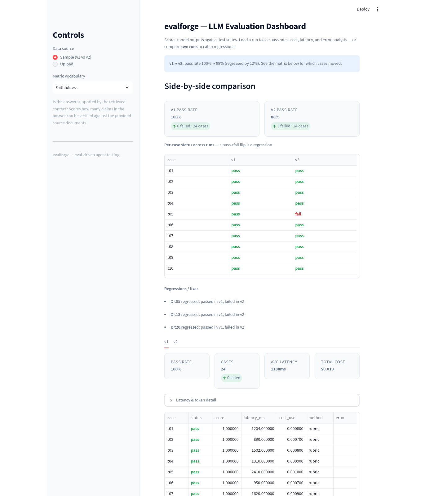

<p align="center">
  
  
  
  
</p>

<h1 align="center">⚒️ EvalForge</h1>
<p align="center"><em>The report card for your AI agents — grades the answer <strong>and</strong> the journey.</em></p>

<p align="center">
  <a href="https://evalforge-wmdbf6rtfxjzh668zugy9d.streamlit.app/"><strong>🚀 Try the Live Demo</strong></a> ·
  <a href="#what-it-does"><strong>What it does</strong></a> ·
  <a href="#quick-start"><strong>Quickstart</strong></a> ·
  <a href="#features"><strong>Features</strong></a> ·
  <a href="#versions"><strong>Versions</strong></a> ·
  <a href="SPEC.md"><strong>Spec</strong></a> ·
  <a href="ARCHITECTURE.md"><strong>Architecture</strong></a>
</p>

---

## What it does

**EvalForge checks whether AI agents actually work — before you trust them.**

AI is great at sounding confident. The problem is it's often *wrong* while sounding confident. EvalForge solves this the same way software engineers have always solved it: **write down what "correct" looks like, run the AI against it, and see exactly where it fails.**

Think of it as **unit tests for AI**. You define a list of questions your customers might ask, run your agent against them, and get a clear report card:

- What % of questions did it answer correctly?
- Which specific questions did it get wrong — and what did it say?
- How fast is it? How much does it cost per answer?
- If you change your agent (new model, new prompt), did anything that used to work *break*?

**v0.2.0 adds the journey:** beyond the final answer, EvalForge grades *how* the agent got there — steps taken, tool calls, loops, errors, and per-tool cost. Two versions can have the **same pass rate** and still differ massively in process. EvalForge catches that.

---

## Screenshots

### Dashboard — compare two versions, catch regressions

<div align="center">
  <a href="https://evalforge-wmdbf6rtfxjzh668zugy9d.streamlit.app/">
    
  </a>
  <p><em>Live app: summary cards, per-case comparison table, regressions flagged in red, and the trajectory report card (process metrics, per-tool rollup, REGRESSED verdict).</em></p>
</div>

---

## How it works

```
  1. WRITE         2. RUN             3. REVIEW
  ─────────────    ──────────────     ──────────────
  You write the    EvalForge calls    Open the dashboard:
  questions your   your agent with    pass rate, cost, speed,
  customers ask +  each one, checks   and exactly which
  what a good      the answer, and    questions it got wrong.
  answer looks     records pass/fail
  like.            + cost + speed.
```

- **You define what "right" means** — no AI needed for that, just knowledge of your business
- **EvalForge does the checking** — deterministically and consistently, every time
- **The dashboard is the scoreboard** — see everything in one view, or compare two versions side-by-side

---

## Quick Start

```bash
# Install (core CLI)
pip install evalforge

# Install with dashboard UI
pip install "evalforge[ui]"

# Scaffold a new evaluation project
evalforge init

# Run the example suite — real execution against evalforge.yaml's target provider,
# capturing each test's trajectory (journey) into the same report
evalforge run test-suites/example/suite.yaml

# Run the same suite against a different model/provider (compare agents or versions)
evalforge run suite.yaml --provider deepseek --model deepseek-chat

# Compare two runs (regression detection) — answer-level diff
evalforge compare baselines/run-1.json evalforge-output/report-<ts>.json

# Compare two runs INCLUDING process quality (trajectory regression)
# Same files, both dimensions: pass rate, cost, latency AND steps/loops/per-tool
evalforge compare run_a.json run_b.json --trajectory

# Import a trajectory export from a sealed-box agent and get a process report card
evalforge import-trajectory trajectory.json --out report.json

# CI gate — exits 0 (pass) or 1 (fail); --fail-on-trajectory-regression also fails on process regressions
evalforge gate
evalforge compare run_a.json run_b.json --trajectory --fail-on-trajectory-regression

# Launch the web dashboard
streamlit run evalforge/ui/streamlit_app.py
```

**One run, both dimensions:** `evalforge run` executes your suite against the configured
provider and records the journey of every test (steps, tokens, cost, latency). The saved
report JSON carries both the answer-level results AND the trajectory report card — so
`compare --trajectory` and the dashboard's trajectory view work on the same file, no
separate trajectory run needed. For tool-using agents, emit tool steps in your
`generate_fn` (via the capture layer) and they appear in the process metrics.

---

## Features

### ✅ Prove your AI works
- **Pass/fail on every question** — run your agent against a test suite and see the pass rate instantly
- **See the actual wrong answers** — not just "failed," but what the agent said vs. what was right

### 🛤️ Grade the journey, not just the answer (v0.2.0)
- **Process report card** — every run gets process metrics: convergence, steps/tool-calls per task, loop count (identical repeated calls), tool validity, error recovery, per-tool cost & latency, budget adherence
- **Trajectory regression** — compare two runs and get a REGRESSED / ok verdict on process quality: *"pass rate identical, but the new version loops 3× more on hard questions"* is caught automatically
- **Capture how you like** — record as your agent runs (drop-in client shims, one-line `emit_step`), or import a trajectory JSON/JSONL export from any agent (OTel-style span shape accepted)
- **Pure-code metrics** — no LLM-as-judge for process quality; every number is deterministic and reproducible
- **CI gate on process** — `compare --trajectory --fail-on-trajectory-regression` exits 1 when the journey degrades even if pass rate holds

### 🚨 Catch regressions before they ship
- **Before/after comparison** — change a model or prompt, rerun, and see exactly which cases broke
- **CI gate** — fail the build automatically if quality drops past a threshold (exit code 0/1, works with any CI)

### 💰 Know what it costs
- **Per-test cost and token counts** — know what every answer costs
- **Latency p50/p95/p99** — catch slow degradations before users notice

### 🔬 Multiple scoring strategies
- **Exact match** — for factual questions with precise answers
- **LLM-as-Judge** — rubric-based evaluation across custom dimensions (accuracy, tone, completeness, etc.)
- **Semantic similarity** — embedding-based comparison for open-ended responses
- **RAGAS-style presets** — faithfulness, answer relevancy, context precision, context recall, answer correctness

### 🧩 Extensible
- **Scorers**: `ExactScorer`, `RubricScorer`, `SemanticScorer` — add custom ones via base class
- **LLM Clients**: DeepSeek, OpenAI, Anthropic — add providers via base class
- **Reporters**: JSON, Console, Diff — add formats via base class
- **Trackers**: Cost, Latency — add metrics via base class

---

## Web Dashboard

Explore evaluation results without touching the CLI. Load one run for metrics, or two runs for a side-by-side regression matrix. From v0.2.0 you can also load trajectory exports and compare **process quality**, not just final answers.

**Live demo (v0.2.0):** https://evalforge-wmdbf6rtfxjzh668zugy9d.streamlit.app/

- **Summary cards** — pass rate, case count, avg latency, total cost
- **Per-case table** — status-highlighted results (pass/fail/error) with scores, latency, cost
- **Regression matrix** — load v1 vs v2 and see exactly which cases flipped pass→fail (regression) or fail→pass (fixed)
- **Trajectory report card** — process metrics per run: mean steps, mean tool calls, loop count, error steps, per-tool rollup (calls, errors, latency, cost)
- **Step timeline** — every tool call with its args, result, latency, and errors
- **Trajectory regression** — compare two runs on process quality with a REGRESSED / ok verdict: same pass rate, worse journey → caught (see the built-in sample)
- **Latency percentiles** — p50/p95/p99 + token usage under the hood
- **RAGAS-style metric presets** — industry-standard rubric vocabulary (faithfulness, answer relevancy, context precision, context recall, answer correctness) built in as LLM-judge rubric templates — no extra dependency
- **Upload support** — drop in your own `RunResult` JSON files (exactly what `evalforge run` writes), or use the three built-in sample pairs — same score / pass rate regressed / both regressed — each generated from real runs through the same Executor path as the CLI

---

## Example Test Suite

```yaml
# test-suites/example/suite.yaml
name: hello-world
tests:
  - id: exact-match
    prompt: "What is the capital of France?"
    expected:
      type: exact
      value: "Paris"

  - id: tone-check
    prompt: "Explain quantum computing to a 5-year-old."
    expected:
      type: rubric
      rubric:
        dimensions:
          - name: accuracy
            description: "Scientifically correct, not misleading"
            weight: 0.4
          - name: simplicity
            description: "Understandable to a child"
            weight: 0.3
          - name: tone
            description: "Encouraging and engaging"
            weight: 0.3
```

---

## CLI Commands

| Command | Description |
|---------|-------------|
| `evalforge init` | Scaffold a new project with example suite |
| `evalforge run <suite>` | Run a test suite against an LLM |
| `evalforge compare <baseline> <candidate>` | Diff two runs (score, cost, latency) |
| `evalforge compare --trajectory` | Diff two runs including process quality |
| `evalforge import-trajectory <file>` | Import a trajectory export → process report card |
| `evalforge gate` | CI gate — checks regression against baseline |
| `evalforge --help` | Show all commands |

---

## Example Output

```json
{
  "suite_name": "hello-world",
  "timestamp": "2026-07-06T20:00:00Z",
  "duration_ms": 1234,
  "tests": [
    {
      "id": "exact-match",
      "status": "pass",
      "score": { "overall": 1.0 },
      "tokens": { "input": 25, "output": 2, "total": 27 },
      "latency_ms": 340,
      "cost_usd": 0.00005
    }
  ],
  "summary": {
    "total": 1, "passed": 1, "failed": 0,
    "pass_rate": 1.0,
    "total_cost_usd": 0.00005,
    "latency_p95": 340
  }
}
```

---

## Architecture

```
CLI Layer (typer)
    └─▶ run | compare | gate | init | import-trajectory
            │
Core Engine Layer
    ├─ Executor (async + semaphore)
    ├─ Scorer Registry
    ├─ Trackers (cost + latency)
    └─ Reporters (JSON, console, diff)
            │
Trajectory Layer (v0.2.0)
    ├─ Capture (client shims, emit_step, framework adapters)
    ├─ Importers (own format, OTel-style spans, JSONL)
    ├─ Metrics (pure code: convergence, loops, tool validity, recovery, per-tool rollup)
    └─ Regression (per-tool/per-test deltas, verdict, CI gate)
            │
Infrastructure Layer
    ├─ LLM Client (httpx/async, multi-provider)
    ├─ Config (YAML via pyyaml)
    └─ Models (Pydantic v2)
```

---

## Configuration

```yaml
# evalforge.yaml
baseline_dir: evalforge-baselines/
suites:
  - path: test-suites/example/suite.yaml
    allowed_regression_pct: 5
judge:
  provider: deepseek
  model: deepseek-chat
target:
  provider: deepseek
  model: deepseek-chat
concurrency: 10
```

---

## Built with

- **Python 3.11+** — core engine (async, Pydantic v2)
- **Streamlit** — web dashboard
- **DeepSeek v4** — primary LLM provider (extensible to any OpenAI-compatible API)

---

## Project Status

**v0.2.0** — Trajectory-level evaluation: process metrics (convergence, efficiency, loops, validity, recovery, per-tool cost/latency), trajectory capture (shims, emit_step, import), trajectory regression with CI gate, and a dashboard trajectory view. **Same pass rate, worse process → caught.** See [Versions](#versions).

### Roadmap

- [x] Test runner with concurrent execution
- [x] LLM-as-Judge scoring with rubrics
- [x] Cost & latency tracking
- [x] CI gate with regression detection
- [x] CLI commands (run, compare, gate, init)
- [x] Web dashboard for visualizing results
- [x] Trajectory-level process metrics (v0.2.0)
- [x] Trajectory capture: shims, emit_step, import (v0.2.0)
- [x] Trajectory regression + CI gate (v0.2.0)
- [ ] GitHub Actions integration
- [ ] Real-time streaming evaluation
- [ ] Plugin system for custom scorers

---

## Versions

| Version | What it is | Release notes |
|---------|-----------|---------------|
| **v0.2.0** | Trajectory-level agent evaluation — grades the journey (process metrics, trajectory regression), not just the final answer | [GitHub Release](https://github.com/rayyanakmal/evalforge/releases/tag/v0.2.0) |
| **v0.1.0** | Original report card — pass rates, LLM-as-Judge rubrics, cost/latency, CI gate, dashboard | [GitHub Release](https://github.com/rayyanakmal/evalforge/releases/tag/v0.1.0) |

**Live demo (v0.2.0):** https://evalforge-wmdbf6rtfxjzh668zugy9d.streamlit.app/ — pick any of the three built-in sample pairs from the sidebar (same score / pass rate / both regressed) to see the report card in action. All samples are real `evalforge run` outputs (answers + trajectories, one file per run) generated by `examples/gen_realistic_samples.py`.

---

## References

- [SPEC.md](SPEC.md) — Full behavior spec with acceptance criteria
- [ARCHITECTURE.md](ARCHITECTURE.md) — Design, interfaces, extension points
- [CHANGELOG.md](CHANGELOG.md) — Version history
- [assets/dashboard.png](assets/dashboard.png) — Dashboard screenshot (v0.2.0, regenerable via scripts/capture_shots.py)
- [examples/gen_realistic_samples.py](examples/gen_realistic_samples.py) — Real-run sample generator: tool-using geography agent, 4 runs / 3 comparison stories (real DeepSeek)
- [examples/geo_facts.yaml](examples/geo_facts.yaml) — Geography QA dataset behind the samples (exact-match scoring)
- [examples/geo_baseline.json](examples/geo_baseline.json) / [geo_more_tools.json](examples/geo_more_tools.json) / [geo_no_tool.json](examples/geo_no_tool.json) / [geo_memory_loopy.json](examples/geo_memory_loopy.json) — Committed sample runs (real DeepSeek, answers + trajectories)
- [examples/gen_samples.py](examples/gen_samples.py) — Legacy v1/v2 regression-story data generator (output-only runs)
- [examples/gen_demo_trajectories.py](examples/gen_demo_trajectories.py) — Legacy trajectory generator (clean vs loop-prone)
- [scripts/capture_shots.py](scripts/capture_shots.py) — Playwright script that regenerates the README screenshots from the live app

---

## License

[MIT](LICENSE)

---

<p align="center">
  Built by <a href="https://github.com/rayyanakmal">@rayyanakmal</a>
</p>
